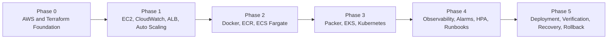
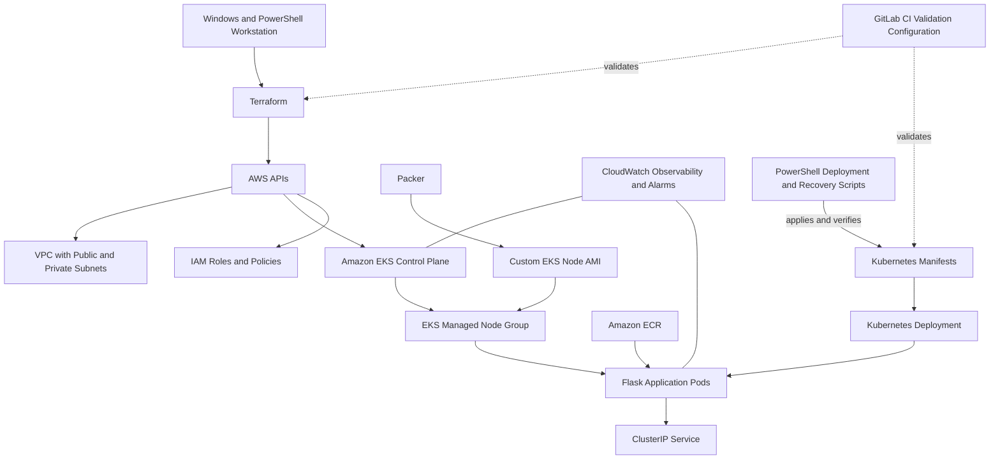

# AWS SRE Reliability Lab

A multi-phase Site Reliability Engineering project that demonstrates how a cloud-hosted application can evolve from a single Amazon EC2 deployment into containerized Amazon ECS and Kubernetes-based Amazon EKS architectures.

The project focuses on Infrastructure as Code, repeatable deployments, observability, controlled failure testing, recovery, troubleshooting, release safety, and operational documentation. Infrastructure is provisioned with Terraform and supported by Docker, Packer, Kubernetes, CloudWatch, PowerShell, Bash, and GitLab CI validation configuration.

**Project status:** Phases 0 through 5 completed  
**Environment:** Hands-on learning and portfolio project  
**Primary focus:** AWS infrastructure, reliability engineering, automation, and operations

## Contents

- [Project Objectives](#project-objectives)
- [Architecture Evolution](#architecture-evolution)
- [Phase Summary](#phase-summary)
- [Key Engineering Outcomes](#key-engineering-outcomes)
- [Reliability and Recovery Testing](#reliability-and-recovery-testing)
- [EKS Troubleshooting Case Study](#eks-troubleshooting-case-study)
- [Deployment Automation and CI Validation](#deployment-automation-and-ci-validation)
- [Repository Structure](#repository-structure)
- [Documentation Index](#documentation-index)
- [Technologies](#technologies)
- [Running the Project](#running-the-project)
- [Cost and Safety Notes](#cost-and-safety-notes)
- [Project History](#project-history)
- [Author](#author)

## Project Objectives

- Provision AWS infrastructure through reusable and version-controlled Terraform configuration.
- Progressively evolve application hosting from EC2 to ECS Fargate and Amazon EKS.
- Practice cloud networking, IAM, load balancing, container orchestration, and workload deployment.
- Add logs, metrics, alarms, health checks, and operational visibility.
- Perform controlled failure tests and verify that services recover to their desired state.
- Reduce manual operational work through PowerShell scripts and CI validation.
- Document architecture, deployments, failures, troubleshooting, recovery, and runbooks.

## Architecture Evolution



### Phase 1: EC2 reliability architecture

```text
Client
  |
Application Load Balancer
  |
Target Group
  |
Auto Scaling Group
  |
Amazon EC2 instances running the web application
  |
Amazon CloudWatch Logs
```

### Phase 2: ECS Fargate architecture

```text
Client
  |
Application Load Balancer
  |
Target Group
  |
Amazon ECS Fargate Service
  |
ECS Tasks running the Dockerized Flask application
  |
Amazon ECR image + Amazon CloudWatch Logs
```

### Phase 3-5: EKS reliability architecture



## Phase Summary

| Phase | Main outcome | Reliability and operations focus | Historical branch | Documentation |
|---|---|---|---|---|
| **Phase 0** | Established AWS authentication, Terraform configuration, repository structure, and documentation foundation. | Repeatable setup, version control, state-file exclusions, and safe change review. | `main` history | [Architecture](docs/architecture.md) |
| **Phase 1** | Deployed an EC2-hosted web application, added CloudWatch visibility, placed instances behind an Application Load Balancer, and introduced Auto Scaling. | Health checks, load balancing, replacement of failed capacity, and recovery validation. | [phase-1-reliability-upgrades](https://github.com/mcamac38/aws-sre-reliability-lab/tree/phase-1-reliability-upgrades) | [EC2 deployment](docs/phase-1-ec2-deployment.md)<br>[ALB deployment](docs/phase-1c-alb-deployment.md)<br>[Auto Scaling](docs/phase-1d-autoscaling-deployment.md)<br>[Failure test](docs/phase-1e-failure-test.md) |
| **Phase 2** | Containerized the Flask application, stored the image in Amazon ECR, and deployed it as an ECS Fargate service behind an ALB. | Desired task count, target health, task replacement, centralized logs, and service recovery. | [phase-2-ecs](https://github.com/mcamac38/aws-sre-reliability-lab/tree/phase-2-ecs) | [ECS deployment](docs/phase-2-ecs-deployment.md)<br>[ECS failure test](docs/phase-2e-ecs-failure-test.md) |
| **Phase 3** | Provisioned EKS networking, control plane, managed worker nodes, Packer-built node images, and Kubernetes application resources. | Cluster access, node bootstrap, workload scheduling, desired state, and systematic troubleshooting. | [phase-3-eks](https://github.com/mcamac38/aws-sre-reliability-lab/tree/phase-3-eks) | [EKS deployment](docs/phase3-eks-deployment.md)<br>[EKS troubleshooting](docs/phase3-eks-troubleshooting.md) |
| **Phase 4** | Added the CloudWatch observability add-on, workload and cluster alarms, Kubernetes Horizontal Pod Autoscaling, and EKS runbooks. | Metrics, logs, alarms, scaling behavior, failure visibility, and operational response procedures. | [phase-4-observability](https://github.com/mcamac38/aws-sre-reliability-lab/tree/phase-4-observability) | [Observability and SRE practices](docs/phase4-observability-sre-practices.md)<br>[Runbooks](docs/runbooks/) |
| **Phase 5** | Added PowerShell workflows for deployment, health verification, recovery, and rollback, plus GitLab CI validation configuration. | Release safety, pre-deployment validation, rollout checks, recovery, rollback, and reduced operational toil. | [phase-5-deployment-automation](https://github.com/mcamac38/aws-sre-reliability-lab/tree/phase-5-deployment-automation) | [Deployment automation](docs/phase5-deployment-automation.md) |

## Key Engineering Outcomes

### Infrastructure as Code

Terraform configuration provisions and connects the major components used throughout the project, including:

- VPC networking, public and private subnets, route tables, an internet gateway, and a NAT gateway
- IAM roles and policy attachments
- Amazon EC2, Application Load Balancing, and Auto Scaling
- Amazon ECR and Amazon ECS Fargate
- Amazon EKS control plane and managed worker nodes
- CloudWatch observability resources and alarms

The project is separated into phase-specific Terraform environments so each architecture can be reviewed and managed independently.

### Progressive application modernization

The same basic application workload was moved through three compute models:

1. A web application running directly on Amazon EC2
2. A Dockerized application running as ECS Fargate tasks
3. A containerized workload managed by Kubernetes on Amazon EKS

This progression demonstrates the changing operational responsibilities, failure modes, deployment mechanisms, and recovery behavior of each platform.

### Operational documentation

The repository includes deployment records, failure-test reports, troubleshooting notes, and runbooks. Documentation is treated as part of the engineering work rather than as a final afterthought.

## Reliability and Recovery Testing

Controlled failures were used to test whether each platform restored its intended state.

### EC2 and Auto Scaling

- Verified that instances registered as healthy behind the Application Load Balancer.
- Terminated or impaired capacity in a controlled test.
- Observed Auto Scaling detect the capacity loss and launch a replacement instance.
- Confirmed that the replacement passed health checks and returned the service to the desired capacity.

### ECS Fargate

- Deployed an ECS service with a desired count of two tasks.
- Stopped a running task to simulate workload loss.
- Observed the ECS service scheduler launch a replacement task.
- Verified that the replacement became healthy and the service returned to its desired task count.

### Kubernetes and EKS

- Validated Deployment and ReplicaSet reconciliation behavior.
- Tested recovery after pod or workload disruption.
- Added deployment health checks and rollout-status verification.
- Practiced recovery and rollback procedures, followed by post-change health validation.

## EKS Troubleshooting Case Study

During Phase 3, the EKS managed node group entered `CREATE_FAILED` with a `NodeCreationFailure` because the EC2 worker instances did not successfully join the cluster.

The investigation did not assume a single cause. It evaluated multiple layers of the system:

- EKS node-group health information
- IAM roles and attached policies
- VPC routing, private-subnet connectivity, and NAT access
- Cluster authentication and access entries
- Launch-template configuration
- EC2 console output and node bootstrap logs
- Packer AMI compatibility and node initialization behavior

The evidence narrowed the failure to the node bootstrap configuration. After correcting the configuration and recreating the affected node resources, the node group reached `ACTIVE`, two worker nodes reported `Ready`, EKS system pods ran successfully, and the application deployment became healthy.

This incident became a documented troubleshooting artifact rather than only a one-time fix:

- [Phase 3 EKS troubleshooting](docs/phase3-eks-troubleshooting.md)

## Deployment Automation and CI Validation

### PowerShell operational scripts

Phase 5 includes scripts for common EKS application operations:

| Script | Purpose |
|---|---|
| [`deploy-eks-app.ps1`](scripts/phase5/deploy-eks-app.ps1) | Applies the Kubernetes resources and checks deployment progress. |
| [`verify-eks-health.ps1`](scripts/phase5/verify-eks-health.ps1) | Reviews the current context, nodes, workloads, deployment status, and service health. |
| [`recover-eks-app.ps1`](scripts/phase5/recover-eks-app.ps1) | Restores the application after a controlled workload failure and validates recovery. |
| [`rollback-eks-app.ps1`](scripts/phase5/rollback-eks-app.ps1) | Rolls the Kubernetes deployment back and verifies the resulting application state. |

The scripts are intended to make repeatable operational steps visible, reviewable, and less dependent on manually re-entering a long sequence of commands.

### GitLab CI validation configuration

The repository includes [`.gitlab-ci.yaml`](.gitlab-ci.yaml) with validation jobs for:

- `terraform fmt -check -recursive`
- `terraform init -backend=false`
- `terraform validate`
- Kubernetes YAML parsing with Python and PyYAML
- Push and merge-request validation rules

This repository is hosted on GitHub, so the GitLab CI file is included as a portable pipeline definition and is not a GitHub Actions workflow.

## Repository Structure

```text
.
├── app/
│   └── ecs-web/                         # Flask application and Docker assets
├── docs/
│   ├── incidents/                       # Incident-documentation location
│   ├── runbooks/                        # EKS operational runbooks
│   ├── architecture.md
│   ├── phase-1-ec2-deployment.md
│   ├── phase-1c-alb-deployment.md
│   ├── phase-1d-autoscaling-deployment.md
│   ├── phase-1e-failure-test.md
│   ├── phase-2-ecs-deployment.md
│   ├── phase-2e-ecs-failure-test.md
│   ├── phase3-eks-deployment.md
│   ├── phase3-eks-troubleshooting.md
│   ├── phase4-observability-sre-practices.md
│   └── phase5-deployment-automation.md
├── kubernetes/
│   ├── phase3-eks/                      # Application deployment and service manifests
│   └── phase4-observability/            # Autoscaling and observability resources
├── packer/
│   └── eks-node-ami/                    # Packer HCL and provisioning scripts
├── scripts/
│   └── phase5/                          # Deploy, verify, recover, and rollback scripts
├── terraform/
│   ├── environments/                    # Phase-specific Terraform root modules
│   └── modules/                         # Reusable infrastructure modules
├── .gitignore
├── .gitlab-ci.yaml
└── README.md
```

## Documentation Index

| Document | Description |
|---|---|
| [Architecture](docs/architecture.md) | Project architecture and organization. |
| [Phase 1 EC2 Deployment](docs/phase-1-ec2-deployment.md) | Initial EC2 application deployment. |
| [Phase 1 ALB Deployment](docs/phase-1c-alb-deployment.md) | Application Load Balancer and target-group integration. |
| [Phase 1 Auto Scaling](docs/phase-1d-autoscaling-deployment.md) | Auto Scaling Group and resilient EC2 capacity. |
| [Phase 1 Failure Test](docs/phase-1e-failure-test.md) | Controlled EC2 failure and recovery validation. |
| [Phase 2 ECS Deployment](docs/phase-2-ecs-deployment.md) | Docker, ECR, ECS Fargate, ALB, and CloudWatch Logs. |
| [Phase 2 ECS Failure Test](docs/phase-2e-ecs-failure-test.md) | ECS task termination and service recovery. |
| [Phase 3 EKS Deployment](docs/phase3-eks-deployment.md) | EKS networking, cluster, nodes, and Kubernetes application deployment. |
| [Phase 3 EKS Troubleshooting](docs/phase3-eks-troubleshooting.md) | Node-group failure investigation and resolution. |
| [Phase 4 Observability and SRE Practices](docs/phase4-observability-sre-practices.md) | CloudWatch observability, alarms, HPA, and runbooks. |
| [Phase 5 Deployment Automation](docs/phase5-deployment-automation.md) | PowerShell deployment, validation, recovery, rollback, and CI validation. |
| [Runbooks](docs/runbooks/) | Operational procedures for EKS workload and cluster response. |

## Technologies

### AWS

- Amazon VPC
- Amazon EC2
- Elastic Load Balancing
- EC2 Auto Scaling
- Amazon ECR
- Amazon ECS and AWS Fargate
- Amazon EKS
- AWS IAM
- Amazon CloudWatch

### Infrastructure and automation

- Terraform
- Packer
- AWS CLI
- PowerShell
- Bash
- Git and GitHub
- GitLab CI configuration

### Containers and Kubernetes

- Docker
- Kubernetes
- `kubectl`
- Deployments, ReplicaSets, Pods, Services, and Horizontal Pod Autoscaling

### Application and platform

- Python
- Flask
- Gunicorn
- Amazon Linux

## Running the Project

> This repository represents multiple completed architectures. Do not deploy every phase at the same time unless that is intentional. Review the phase documentation before creating resources.

### Prerequisites

- An AWS account with permissions for the services used by the selected phase
- AWS CLI installed and authenticated
- Terraform installed
- Git installed
- Docker for the ECS and EKS application image
- Packer for the custom EKS node image
- `kubectl` for Kubernetes administration
- PowerShell for the Phase 5 operational scripts

### Clone the repository

```powershell
git clone https://github.com/mcamac38/aws-sre-reliability-lab.git
Set-Location .\aws-sre-reliability-lab
```

### Confirm AWS authentication

```powershell
aws sts get-caller-identity
```

### Select a Terraform environment

```powershell
Set-Location .\terraform\environments\<environment-name>
```

Then use the standard review workflow:

```powershell
terraform init
terraform fmt -check
terraform validate
terraform plan
terraform apply
```

The selected phase may require additional work before or after Terraform, such as building and pushing a Docker image, building a Packer AMI, updating kubeconfig, or applying Kubernetes manifests. Follow the corresponding document in the [Documentation Index](#documentation-index).

### Verify changes

Use the relevant AWS, Terraform, Docker, ECS, EKS, CloudWatch, or Kubernetes commands described in the phase documentation. For Phase 5, the health-verification script provides a repeatable EKS application check:

```powershell
.\scripts\phase5\verify-eks-health.ps1
```

## Cost and Safety Notes

- This is a learning environment, not a continuously running production platform.
- EKS, NAT gateways, load balancers, EC2 instances, and other AWS resources can continue generating charges while deployed.
- Review `terraform plan` before every apply or destroy operation.
- Destroy resources when they are no longer needed, using the phase-specific teardown order.
- Terraform state, plan files, credentials, and other sensitive local artifacts should not be committed to the repository.
- Validate the active AWS account and region before creating or deleting infrastructure.

## Project History

The project was developed cumulatively. Each phase branch preserves the repository at a completed milestone, while `main` contains the merged final state.

| Branch | Milestone |
|---|---|
| [`phase-1-reliability-upgrades`](https://github.com/mcamac38/aws-sre-reliability-lab/tree/phase-1-reliability-upgrades) | EC2 visibility, load balancing, Auto Scaling, and recovery testing |
| [`phase-2-ecs`](https://github.com/mcamac38/aws-sre-reliability-lab/tree/phase-2-ecs) | Docker, ECR, ECS Fargate, and task recovery |
| [`phase-3-eks`](https://github.com/mcamac38/aws-sre-reliability-lab/tree/phase-3-eks) | Packer, Amazon EKS, Kubernetes, and node troubleshooting |
| [`phase-4-observability`](https://github.com/mcamac38/aws-sre-reliability-lab/tree/phase-4-observability) | CloudWatch observability, alarms, HPA, and runbooks |
| [`phase-5-deployment-automation`](https://github.com/mcamac38/aws-sre-reliability-lab/tree/phase-5-deployment-automation) | Deployment, health verification, recovery, rollback, and CI validation |

The full progression can also be reviewed through the repository's commit and pull-request history.

## Author

**Matthew Camacho**  
Cloud Infrastructure and Site Reliability Engineering  

- [GitHub](https://github.com/mcamac38)
- [LinkedIn](https://www.linkedin.com/in/matthew-camacho-246797348/)

---

This project was created for hands-on learning and portfolio development. It demonstrates applied infrastructure and reliability concepts in a controlled AWS environment and is not presented as a production-ready platform.
